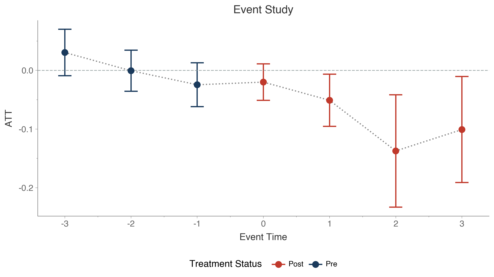

</img>
</img>

[](https://github.com/astral-sh/ruff)
[](https://www.repostatus.org/#active)
[](https://github.com/jordandeklerk/moderndid/actions/workflows/test.yml)
[](https://codecov.io/gh/jordandeklerk/moderndid)
[](https://moderndid.readthedocs.io/en/latest/)
[](https://github.com/jordandeklerk/moderndid/graphs/commit-activity)
[](https://github.com/jordandeklerk/moderndid/graphs/commit-activity)
[](https://www.python.org/)


__moderndid__ is a unified Python implementation of modern difference-in-differences (DiD) methodologies, bringing together the fragmented landscape of DiD estimators into a single, coherent framework. This package consolidates methods from leading econometric research and various R packages into one comprehensive Python library with a consistent API.

> [!WARNING]
> This package is currently in active development with core estimators and some sensitivity analysis implemented. The API is subject to change.

## Installation

```bash
uv pip install moderndid
```

Or install from source:

```bash
uv pip install git+https://github.com/jordandeklerk/moderndid.git
```

## Features

- **Multiple DiD estimators** — Staggered adoption, doubly robust, continuous treatment, triple difference, and sensitivity analysis
- **Fast computation** — [Polars](https://pola.rs/) for data wrangling, [NumPy](https://numpy.org/) vectorization, and [Numba](https://numba.pydata.org/) JIT compilation for performance-critical paths
- **Native plots** — Built on [plotnine](https://plotnine.org/) with full customization support
- **Robust inference** — Analytical standard errors, bootstrap (weighted and multiplier), and simultaneous confidence bands
- **Documentation** — [https://moderndid.readthedocs.io/en/latest/index.html](https://moderndid.readthedocs.io/en/latest/index.html)

### Consistent API

All estimators share a unified interface, making it easy to switch between methods:

```python
# Staggered DiD
result = did.att_gt(data, yname="y", tname="t", idname="id", gname="g", ...)

# Triple DiD
result = did.ddd(data, yname="y", tname="t", idname="id", gname="g", pname="p", ...)

# Continuous DiD
result = did.cont_did(data, yname="y", tname="t", idname="id", gname="g", dname="dose", ...)

# Doubly robust 2-period DiD
result = did.drdid(data, yname="y", tname="t", idname="id", treatname="treat", ...)
```

### Example Datasets

Several classic datasets from the DiD literature are included for learning and experimentation:

```python
did.load_mpdta()  # County teen employment (staggered adoption)
did.load_nsw()    # NSW job training program (2-period panel)
did.load_ehec()   # Medicaid expansion (sensitivity analysis)
did.load_engel()  # Household expenditure (continuous treatment)
```

## Quick Start

This example uses county-level teen employment data to estimate the effect of minimum wage increases. States adopted higher minimum wages at different times (2004, 2006, or 2007), making this a staggered adoption design.

```python
import moderndid as did

# Example data
data = did.load_mpdta()

# Estimate group-time average treatment effects
result = did.att_gt(
    data=data,
    yname="lemp",
    tname="year",
    idname="countyreal",
    gname="first.treat",
    est_method="dr",
)
print(result)
```

The output shows treatment effects for each group (defined by when they were first treated) at each time period:

```
Group-Time Average Treatment Effects:
  Group   Time   ATT(g,t)   Std. Error  [95% Simult. Conf. Band]
   2004   2004    -0.0105       0.0239  [ -0.0745,   0.0535]
   2004   2005    -0.0704       0.0304  [ -0.1517,   0.0109]
   2004   2006    -0.1373       0.0363  [ -0.2346,  -0.0400] *
   2004   2007    -0.1008       0.0340  [ -0.1919,  -0.0097] *
   2006   2004     0.0065       0.0242  [ -0.0582,   0.0712]
   2006   2005    -0.0028       0.0199  [ -0.0560,   0.0505]
   2006   2006    -0.0046       0.0175  [ -0.0515,   0.0423]
   2006   2007    -0.0412       0.0211  [ -0.0976,   0.0152]
   2007   2004     0.0305       0.0144  [ -0.0082,   0.0692]
   2007   2005    -0.0027       0.0170  [ -0.0483,   0.0429]
   2007   2006    -0.0311       0.0177  [ -0.0784,   0.0162]
   2007   2007    -0.0261       0.0159  [ -0.0687,   0.0166]
---
Signif. codes: '*' confidence band does not cover 0

P-value for pre-test of parallel trends assumption:  0.1681

Control Group:  Never Treated,
Anticipation Periods:  0
Estimation Method:  Doubly Robust
```

These group-time effects can be aggregated into an event study to see how effects evolve relative to treatment:

```python
event_study = did.aggte(result, type="dynamic")
print(event_study)
```

```
==============================================================================
 Aggregate Treatment Effects (Event Study)
==============================================================================

 Overall summary of ATT's based on event-study/dynamic aggregation:

       ATT      Std. Error     [95% Conf. Interval]
   -0.0772          0.0204     [ -0.1172,  -0.0372] *


 Dynamic Effects:

    Event time   Estimate   Std. Error   [95% Simult. Conf. Band]
            -3     0.0269       0.0146   [-0.0127,  0.0666]
            -2    -0.0046       0.0136   [-0.0413,  0.0322]
            -1    -0.0245       0.0143   [-0.0633,  0.0144]
             0    -0.0199       0.0118   [-0.0519,  0.0121]
             1    -0.0510       0.0168   [-0.0966, -0.0053] *
             2    -0.1373       0.0363   [-0.2357, -0.0388] *
             3    -0.1008       0.0342   [-0.1936, -0.0080] *

------------------------------------------------------------------------------
 Signif. codes: '*' confidence band does not cover 0
```

Plot the event study results:

```python
did.plot_event_study(event_study)
```



## Available Methods

### Core Implementations

| Module | Description | Reference |
|--------|-------------|-----------|
| [`moderndid.did`](moderndid/did) | Staggered DiD with group-time effects | [Callaway & Sant'Anna (2021)](https://arxiv.org/pdf/1803.09015) |
| [`moderndid.drdid`](moderndid/drdid) | Doubly robust 2-period estimators | [Sant'Anna & Zhao (2020)](https://arxiv.org/pdf/1812.01723) |
| [`moderndid.didhonest`](moderndid/didhonest) | Sensitivity analysis for parallel trends | [Rambachan & Roth (2023)](https://asheshrambachan.github.io/assets/files/hpt-draft.pdf) |
| [`moderndid.didcont`](moderndid/didcont) | Continuous/multi-valued treatments | [Callaway et al. (2024)](https://arxiv.org/pdf/2107.02637) |
| [`moderndid.didtriple`](moderndid/didtriple) | Triple difference-in-differences | [Ortiz-Villavicencio & Sant'Anna (2025)](https://arxiv.org/pdf/2505.09942) |

### Planned Development

| Module | Description | Reference |
|--------|-------------|-----------|
| `moderndid.didinter` | Intertemporal DiD with non-absorbing treatment | [Chaisemartin & D'Haultfœuille (2024)](https://arxiv.org/pdf/2007.04267) |
| `moderndid.didml` | Machine learning approaches to DiD | [Hatamyar et al. (2023)](https://arxiv.org/pdf/2310.11962) |
| `moderndid.drdidweak` | Robust to weak overlap | [Ma et al. (2023)](https://arxiv.org/pdf/2304.08974) |
| `moderndid.didcomp` | Compositional changes in repeated cross-sections | [Sant'Anna & Xu (2025)](https://arxiv.org/pdf/2304.13925) |
| `moderndid.didimpute` | Imputation-based estimators | [Borusyak, Jaravel, & Spiess (2024)](https://arxiv.org/pdf/2108.12419) |
| `moderndid.didbacon` | Goodman-Bacon decomposition | [Goodman-Bacon (2019)](https://cdn.vanderbilt.edu/vu-my/wp-content/uploads/sites/2318/2019/07/29170757/ddtiming_7_29_2019.pdf) |
| `moderndid.didlocal` | Local projections DiD | [Dube et al. (2025)](https://www.nber.org/system/files/working_papers/w31184/w31184.pdf) |
| `moderndid.did2s` | Two-stage DiD | [Gardner (2021)](https://jrgcmu.github.io/2sdd_current.pdf) |
| `moderndid.etwfe` | Extended two-way fixed effects | [Wooldridge (2021)](https://ssrn.com/abstract=3906345), [Wooldridge (2023)](https://doi.org/10.1093/ectj/utad016) |
| `moderndid.functional` | Specification tests | [Roth & Sant'Anna (2023)](https://arxiv.org/pdf/2010.04814) |
