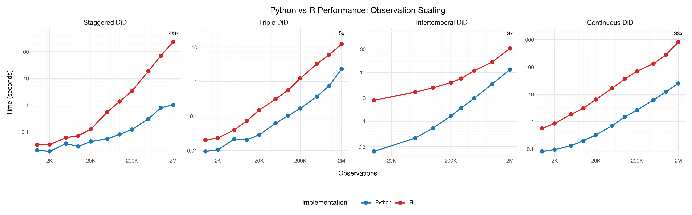

# Benchmark Suite

This benchmark suite measures the computational performance of `moderndid` estimators against their canonical R implementations. It provides reproducible timing comparisons across configurable dimensions including dataset size, number of time periods, treatment groups, covariates, and bootstrap iterations.

## Quick Start

```bash
# att_gt benchmarks
python -m benchmark.did.run_benchmark --suite quick --python-only

# ddd benchmarks
python -m benchmark.didtriple.run_benchmark --suite quick --python-only

# cont_did benchmarks
python -m benchmark.didcont.run_benchmark --suite quick --python-only
```

See module-specific READMEs for detailed CLI options:
- [`benchmark/did/README.md`](did/README.md) — att_gt vs R did
- [`benchmark/didtriple/README.md`](didtriple/README.md) — ddd vs R triplediff
- [`benchmark/didcont/README.md`](didcont/README.md) — cont_did vs R contdid

## Methodology

The benchmark suite ensures fair comparisons between Python and R:

- **Same Data** — Both receive identical datasets (R via CSV export)
- **Same Configuration** — Equivalent parameters for both implementations
- **Same Timing Protocol** — Warmup runs, garbage collection, multiple timed runs
- **Same Computation** — Verified via matching number of estimates

## Requirements

**Python:**
- Python 3.10+
- moderndid, polars, numpy

**R (optional):**
- R with `did`, `triplediff`, `contdid`, and `jsonlite` packages

## Results


