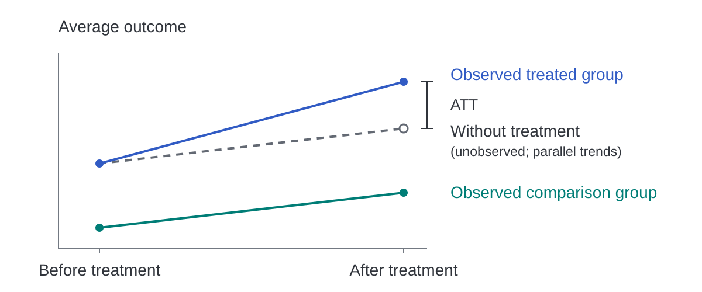

.. _causal_inference:

=========================================
Introduction to difference-in-differences
=========================================

Difference-in-differences (DiD) studies a treatment's effect by comparing
outcome changes for units that receive treatment with changes for units that
remain untreated. For the minimum wage data used in our
:doc:`first analysis <quickstart>`, the question is how raising the wage
affected teen employment. An employment change after the increase cannot
answer that question on its own because employment could also respond to
the business cycle or other developments in a county. The untreated counties
help estimate what would have happened without the wage increase.

We'll follow that question from the basic causal inference problem through
the two-group, two-period DiD design to studies where treatment begins at
different times. Along the way, you'll see why the assumptions matter, how
conventional regressions enter the analysis, and why modern estimators keep
some comparisons separate. The
:doc:`background pages <../background/index>` give the formal assumptions and
derivations for each method once you want to work through them in detail.

The outcome you cannot observe
------------------------------

For a unit observed before and after treatment, write :math:`Y_s(0)` for the
outcome it would have in period :math:`s` without treatment and
:math:`Y_s(1)` for its outcome with treatment. A unit can be a county, a firm,
or another entity whose outcomes you follow. Let :math:`D=1` indicate that
it belongs to the treated group and :math:`D=0` indicate the comparison group.

The average treatment effect on the treated (ATT) asks how treatment changed
the outcome for the units that received it. It compares their treated and
untreated potential outcomes in the same post-treatment period :math:`t`,

.. math::

   ATT = \mathbb{E}[Y_t(1)-Y_t(0)\mid D=1].

In the minimum wage study, this target averages the employment effect across
counties whose states raised the wage. It does not describe how the policy
would affect every county or imply that all treated counties share the same
effect. Although you observe :math:`Y_t(1)` for the treated counties, their
counterfactual employment under no increase, :math:`Y_t(0)`, is missing.
A before-and-after comparison does not recover it because employment might
have changed even without the policy.

Comparing treated and untreated counties in the post-treatment year alone
also leaves a problem. Counties whose states chose to raise the wage may
have had different employment even if neither group had received treatment.
With observational data, treatment assignment can reflect characteristics
that also affect outcomes. DiD uses the earlier outcomes to allow for
differences between the groups, provided those differences would have
remained stable on average without treatment.

Use an untreated change to construct the comparison
---------------------------------------------------

Suppose no units are treated in period :math:`t-1` and only the treated group
receives treatment in period :math:`t`. Under no anticipation, the earlier
outcomes have not already responded to the future policy. We use that
untreated period as a baseline and subtract the comparison group's outcome
change from the treated group's change over the same periods.

You can think of that calculation as constructing a missing outcome. Start
from the treated group's average employment before the policy and add the
change observed among untreated counties. The result is the treated group's
counterfactual average employment after the policy if both groups would
have experienced the same untreated change.

For that subtraction to recover the ATT, the groups must have the same
average change in outcomes under no treatment. This is the parallel trends
assumption,

.. math::

   \mathbb{E}[Y_t(0)-Y_{t-1}(0)\mid D=1]
   = \mathbb{E}[Y_t(0)-Y_{t-1}(0)\mid D=0].

Parallel trends allows the groups to have different employment levels
before treatment because it concerns how those levels would change without
the policy. Choosing counties with similar employment levels alone does not
establish the assumption; their untreated employment changes must also be
comparable during the period you study.

If parallel trends and no anticipation hold, the unobserved trend for the
treated group equals the observed trend for the comparison group. Substituting
that trend into the ATT gives the two-period DiD formula,

.. math::

   ATT = \mathbb{E}[Y_t-Y_{t-1}\mid D=1]
   - \mathbb{E}[Y_t-Y_{t-1}\mid D=0].

The figure below shows how this comparison separates an observed outcome
change from the treatment effect. The dashed path carries the comparison
group's change forward from the treated group's starting point. Since its
endpoint is unobserved, parallel trends supplies that part of the comparison.
The vertical gap between this endpoint and the treated group's observed
outcome is the ATT.

l is the ATT.
   :width: 100%

   The paths in this schematic illustrate the DiD calculation rather than
   employment estimates from the county data.

This interpretation also requires that the comparison units remain
untreated and that their outcomes are not changed by spillovers from the
treated units. The estimate cannot distinguish a treatment effect from an
unrelated shock that affects only the treated group at the same time.

.. admonition:: The comparison needs a substantive reason
   :class: important

   A fitted model cannot establish why the untreated group represents the
   treated group's missing outcome path. That argument comes from the policy,
   how treatment was assigned and what else changed during your study.

The timing and measurement of the outcome belong in that argument too.
If employers respond to an announced wage increase before it takes effect,
the period just before adoption may already contain a policy response.
You would need an earlier unaffected baseline or a method that allows for
anticipation. Parallel trends also concerns the outcome as you measure it.
In the county example, the outcome is log employment. Its parallel trends
assumption therefore concerns changes in log employment rather than changes
in the number of jobs.
`Roth and Sant'Anna (2023) <https://psantanna.com/files/ECTA19402.pdf>`_
explain why parallel trends in one outcome scale generally does not imply
parallel trends in another.

ModernDiD's :func:`~moderndid.drdid` estimates this two-period ATT with panel
data or repeated cross-sections. The :doc:`two-period background
<../background/drdid>` explains the additional conditions each data structure
requires.

.. _conditional-parallel-trends:

Make the comparison conditional on observed characteristics
-----------------------------------------------------------

Treated and comparison units may differ in characteristics that predict
outcome growth. In the county data, population is one possible characteristic
to consider. If employment trends vary with population, a comparison that
adjusts for pre-policy population can be more plausible than one that treats
all counties as comparable.

Conditional parallel trends requires the same untreated outcome change among
treated and comparison units with the same covariates :math:`X`. You also need
overlap so that the characteristics of treated units are represented among
comparison units in the data. If those comparisons are absent from the sample,
covariate adjustment cannot supply them.

You pass the covariates through ``xformla`` in estimators such as
:func:`~moderndid.att_gt`. Its default ``est_method="dr"`` combines an outcome
regression with a propensity score model. Under the identifying assumptions,
the doubly robust estimator is consistent when either working model is
correctly specified. You still need parallel trends and overlap because
double robustness concerns estimation of an already identified effect. The
:doc:`data guide <data>` explains how to choose covariates measured before
treatment can affect them.

Keep adoption dates separate
----------------------------

The two-period calculation can also be estimated through a regression.
In a balanced panel with two periods, one treated group, and no covariates,
ordinary least squares with unit and period fixed effects gives the same
estimate as subtracting the two groups' sample mean changes. This numerical
equivalence helped make two-way fixed effects (TWFE) regressions a common
way to estimate DiD designs with more periods and adoption dates. Their
convenience comes from summarizing all those observations in one treatment
coefficient.

Once adoption dates differ across units, the regression coefficient combines
a broader set of comparisons. When units adopt in different periods and
remain treated afterward, an earlier adopter is
already exposed to treatment when a later adopter begins. A conventional
TWFE regression compares later adopters partly against these already-treated
units. If the earlier cohort's effect changes during the comparison, its
outcome change contains a treatment response that the regression subtracts
from the later cohort's change. `Goodman-Bacon (2021)
<https://doi.org/10.1016/j.jeconom.2021.03.014>`_ explains how the coefficient
combines these two-group, two-period comparisons. Even under parallel
trends and no anticipation, that combination need not recover the average
effect you want when effects differ across cohorts or change with exposure.

Following the response over time often involves an event study, where effects
are indexed by periods before or after adoption. A conventional TWFE
event-study regression replaces the single treatment indicator with leads
and lags. When treatment effects vary across adoption cohorts, its lead and lag
coefficients can mix effects from other event times. As a result, apparent
pre-treatment differences can arise from treatment effects after adoption.
`Sun and Abraham (2021) <https://doi.org/10.1016/j.jeconom.2020.09.006>`_
explain this problem for conventional event-study regressions. It is a reason
to choose the estimator before interpreting the shape of an event study.

The approach of `Callaway and Sant'Anna (2021)
<https://doi.org/10.1016/j.jeconom.2020.12.001>`_ instead estimates effects
separately for each adoption cohort and period. If :math:`G=g` identifies units
first treated in period :math:`g`, its target is

.. math::

   ATT(g,t) = \mathbb{E}[Y_t(g)-Y_t(0)\mid G=g].

Here :math:`Y_t(g)` describes the outcome under adoption in period :math:`g`,
rather than the binary treatment state used in the two-period notation.
The target :math:`ATT(2004,2006)` concerns the 2004 cohort's employment in 2006
relative to its own employment under no wage increase. We use untreated
comparison counties to learn about that missing outcome through a parallel
trends assumption.

The :func:`~moderndid.att_gt` function estimates these group-time effects.
Its ``control_group`` argument chooses never-treated units or units that
remain untreated during the comparison. Later adopters can serve as comparison
units without randomly assigned adoption dates as long as parallel trends is
credible for those comparisons and you account for possible anticipation.

Decide which average answers your question
------------------------------------------

A collection of group-time effects lets you choose the average that answers
your question about the policy. If you want to know how effects change with
exposure, an event study averages effects at a given time since adoption.
You can instead summarize one cohort's experience over its observed treated
periods or average the effects for all cohorts already treated in a
particular calendar year.

Because those averages can describe different populations and exposure
lengths, they need not give the same answer. In an event study, later adopters may
contribute to the first-year effect but have no observations several years
after treatment. A changing curve can therefore reflect a changing mix of
cohorts as well as changing effects within cohorts.

ModernDiD's :func:`~moderndid.aggte` computes these summaries from an
``att_gt`` result. The :doc:`results guide <results>` explains their weights
and how to restrict an event window when you want to hold its cohort
composition fixed.

Assess the assumptions behind the result
-----------------------------------------

Pre-treatment comparisons can reveal differences in outcome changes before
the policy begins. With several observations before adoption, we can examine
those changes through plots and tests of pre-treatment effects.
This provides evidence about the research design without
verifying the treated group's unobserved post-treatment outcomes.
A failure to detect a pre-treatment difference may also reflect imprecise
estimates rather than close agreement between the groups. Confidence
intervals quantify sampling uncertainty under the design's
assumptions without measuring how far those assumptions might be from holding.
The :doc:`results guide <results>` explains how to read that uncertainty for
an individual effect and for an entire event study.

Treat these checks as part of the argument for your design rather than a
requirement to obtain a large p-value. Choosing a specification because it
passes a pre-treatment test can also change the statistical behavior of the
reported estimates and intervals, as `Roth (2022)
<https://www.jonathandroth.com/assets/files/roth_pretrends_testing.pdf>`_
shows. `Sant'Anna's lecture on pre-tests
<https://psantanna.com/DiD/10_Pretest.pdf>`_ discusses what earlier outcomes
can establish and how the conclusion depends on the assumptions being tested.

The :ref:`sensitivity analysis example <example_honest_did>` shows another way
to assess the conclusion. It uses :func:`~moderndid.honest_did` to construct
confidence intervals under specified bounds on departures from parallel
trends. You still need to justify those bounds in the context of the study.

The :doc:`first analysis <quickstart>` puts this reasoning into a fit using
ModernDiD's bundled county data. Designs where treatment reverses,
varies in dose, or applies only to an eligible subgroup need their own
definitions of effects and comparisons. The :doc:`estimator guide
<estimator_overview>` helps you find the method and assumptions for those
settings.

For a longer introduction, `Pedro Sant'Anna's public DiD course
<https://psantanna.com/did-resources/>`_ works through the foundations and
extensions in lecture slides. `Baker, Callaway, Cunningham, Goodman-Bacon,
and Sant'Anna's practitioner guide (2026)
<https://psantanna.com/files/DiD_JEL.pdf>`_ develops the same questions
through an applied study, from defining the causal target to estimation
and inference.
