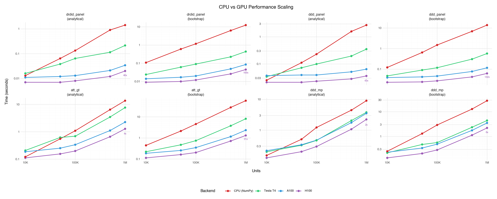

# GPU Benchmark

`gpu_benchmark.py` compares CPU (NumPy) vs GPU (CuPy) performance across all
GPU-accelerated estimators in moderndid.

## Running

Requires a CUDA-capable GPU with CuPy installed:

```bash
uv pip install "moderndid[gpu]"
python scripts/gpu_benchmark.py
```

## Testing

**Correctness** — runs each estimator on both backends and asserts
that ATT and SE estimates match within 1e-6 tolerance:

- `att_gt` (multi-period DiD)
- `drdid_panel` (2-period DR DiD)
- `ddd_panel` (2-period DDD)
- `ddd_mp` (multi-period DDD)

**Scaling** — times each estimator at 10k, 50k, 100k, 500k, and 1M
units with both analytical and bootstrap inference.

## Hardware

CPU baseline for all GPU runs is the host vCPU of each cloud instance.
Local development uses the MacBook Pro listed below.

| Label | Device | VRAM | Driver / CUDA | Host CPU | Host RAM |
| --- | --- | --- | --- | --- | --- |
| **Local** | Apple M2 Pro (integrated) | shared 16 GB | — | Apple M2 Pro (10-core) | 16 GB |
| **Tesla T4** | NVIDIA Tesla T4 | 15 GB GDDR6 | 550.54.15 / CUDA 12.4 | Intel Xeon @ 2.00 GHz (4 vCPU) | 15 GB |
| **A100** | NVIDIA A100-SXM4-40GB | 40 GB HBM2e | 550.54.15 / CUDA 12.4 | AMD EPYC Milan (12 vCPU) | 85 GB |
| **H100** | NVIDIA H100-SXM5-80GB | 80 GB HBM3 | 550.90.07 / CUDA 12.4 | Intel Xeon Sapphire Rapids (26 vCPU) | 200 GB |

## Results

All benchmarks use CuPy 13.6.0 with CUDA 12.9.

### Peak speedups at 1M units

| Estimator | Inference | Tesla T4 | A100 | H100 |
| --- | --- | --- | --- | --- |
| `drdid_panel` | Analytical | 6.62x | 39.77x | 46.39x |
| `drdid_panel` | Bootstrap | 28.31x | 137.46x | 167.96x |
| `ddd_panel` | Analytical | 7.71x | 37.70x | 42.45x |
| `ddd_panel` | Bootstrap | 23.96x | 111.62x | 131.92x |
| `att_gt` | Analytical | 1.79x | 3.19x | 3.72x |
| `att_gt` | Bootstrap | 7.20x | 22.50x | 30.56x |
| `ddd_mp` | Analytical | 2.39x | 2.28x | 2.39x |
| `ddd_mp` | Bootstrap | 6.36x | 5.50x | 5.61x |



---

### Tesla T4

<details>
<summary>Comparison</summary>

#### Tesla T4 — drdid_panel (analytical SE)

| Config | CPU (s) | GPU (s) | Speedup |
| --- | --- | --- | --- |
| 10,000 units | 0.013 | 0.016 | 0.80x |
| 50,000 units | 0.064 | 0.038 | 1.67x |
| 100,000 units | 0.133 | 0.064 | 2.09x |
| 500,000 units | 0.899 | 0.114 | 7.87x |
| 1,000,000 units | 1.415 | 0.214 | 6.62x |

#### Tesla T4 — drdid_panel (bootstrap, 500 iterations)

| Config | CPU (s) | GPU (s) | Speedup |
| --- | --- | --- | --- |
| 10,000 units | 0.108 | 0.024 | 4.50x |
| 50,000 units | 0.599 | 0.061 | 9.86x |
| 100,000 units | 1.167 | 0.090 | 12.90x |
| 500,000 units | 6.222 | 0.224 | 27.82x |
| 1,000,000 units | 12.366 | 0.437 |28.31x |

#### Tesla T4 — ddd_panel (analytical SE)

| Config | CPU (s) | GPU (s) | Speedup |
| --- | --- | --- | --- |
| 10,000 units | 0.025 | 0.034 | 0.74x |
| 50,000 units | 0.111 | 0.072 | 1.54x |
| 100,000 units | 0.229 | 0.099 | 2.30x |
| 500,000 units | 1.580 | 0.195 | 8.11x |
| 1,000,000 units | 2.703 | 0.351 | 7.71x |

#### Tesla T4 — ddd_panel (bootstrap, 500 iterations)

| Config | CPU (s) | GPU (s) | Speedup |
| --- | --- | --- | --- |
| 10,000 units | 0.121 | 0.047 | 2.58x |
| 50,000 units | 0.644 | 0.090 | 7.16x |
| 100,000 units | 1.486 | 0.117 | 12.68x |
| 500,000 units | 6.872 | 0.306 | 22.43x |
| 1,000,000 units | 13.735 | 0.573 |23.96x |

#### Tesla T4 — att_gt (analytical SE)

| Config | CPU (s) | GPU (s) | Speedup |
| --- | --- | --- | --- |
| 10,000 units | 0.121 | 0.207 | 0.58x |
| 50,000 units | 0.551 | 0.619 | 0.89x |
| 100,000 units | 1.087 | 0.688 | 1.58x |
| 500,000 units | 6.435 | 3.458 | 1.86x |
| 1,000,000 units | 13.649 | 7.645 | 1.79x |

#### Tesla T4 — att_gt (bootstrap, 500 iterations)

| Config | CPU (s) | GPU (s) | Speedup |
| --- | --- | --- | --- |
| 10,000 units | 0.442 | 0.221 | 2.00x |
| 50,000 units | 2.118 | 0.470 | 4.51x |
| 100,000 units | 4.534 | 0.741 | 6.12x |
| 500,000 units | 27.893 | 3.754 | 7.43x |
| 1,000,000 units | 58.118 | 8.071 |7.20x |

#### Tesla T4 — ddd_mp (analytical SE)

| Config | CPU (s) | GPU (s) | Speedup |
| --- | --- | --- | --- |
| 10,000 units | 0.150 | 0.197 | 0.76x |
| 50,000 units | 0.503 | 0.322 | 1.56x |
| 100,000 units | 1.218 | 0.462 | 2.64x |
| 500,000 units | 4.452 | 2.042 | 2.18x |
| 1,000,000 units | 9.043 | 3.788 | 2.39x |

#### Tesla T4 — ddd_mp (bootstrap, 500 iterations)

| Config | CPU (s) | GPU (s) | Speedup |
| --- | --- | --- | --- |
| 10,000 units | 0.248 | 0.215 | 1.15x |
| 50,000 units | 1.295 | 0.469 | 2.76x |
| 100,000 units | 2.895 | 0.560 | 5.17x |
| 500,000 units | 12.814 | 2.341 | 5.47x |
| 1,000,000 units | 27.967 | 4.398 |6.36x |

</details>

---

### A100

<details>
<summary>Comparison</summary>

#### A100 — drdid_panel (analytical SE)

| Config | CPU (s) | GPU (s) | Speedup |
| --- | --- | --- | --- |
| 10,000 units | 0.014 | 0.011 | 1.24x |
| 50,000 units | 0.062 | 0.012 | 5.26x |
| 100,000 units | 0.120 | 0.013 | 9.45x |
| 500,000 units | 0.653 | 0.021 | 31.12x |
| 1,000,000 units | 1.347 | 0.034 |39.77x |

#### A100 — drdid_panel (bootstrap, 500 iterations)

| Config | CPU (s) | GPU (s) | Speedup |
| --- | --- | --- | --- |
| 10,000 units | 0.114 | 0.014 | 7.87x |
| 50,000 units | 0.605 | 0.017 | 35.29x |
| 100,000 units | 1.177 | 0.020 | 57.54x |
| 500,000 units | 5.882 | 0.049 | 120.67x |
| 1,000,000 units | 11.752 | 0.085 |137.46x |

#### A100 — ddd_panel (analytical SE)

| Config | CPU (s) | GPU (s) | Speedup |
| --- | --- | --- | --- |
| 10,000 units | 0.026 | 0.037 | 0.71x |
| 50,000 units | 0.113 | 0.039 | 2.93x |
| 100,000 units | 0.219 | 0.039 | 5.57x |
| 500,000 units | 1.129 | 0.051 | 22.29x |
| 1,000,000 units | 2.399 | 0.064 |37.70x |

#### A100 — ddd_panel (bootstrap, 500 iterations)

| Config | CPU (s) | GPU (s) | Speedup |
| --- | --- | --- | --- |
| 10,000 units | 0.125 | 0.039 | 3.17x |
| 50,000 units | 0.655 | 0.042 | 15.49x |
| 100,000 units | 1.285 | 0.046 | 27.81x |
| 500,000 units | 6.475 | 0.077 | 84.01x |
| 1,000,000 units | 12.908 | 0.116 |111.62x |

#### A100 — att_gt (analytical SE)

| Config | CPU (s) | GPU (s) | Speedup |
| --- | --- | --- | --- |
| 10,000 units | 0.096 | 0.186 | 0.51x |
| 50,000 units | 0.363 | 0.251 | 1.45x |
| 100,000 units | 0.984 | 0.336 | 2.92x |
| 500,000 units | 3.554 | 1.108 | 3.21x |
| 1,000,000 units | 7.190 | 2.254 | 3.19x |

#### A100 — att_gt (bootstrap, 500 iterations)

| Config | CPU (s) | GPU (s) | Speedup |
| --- | --- | --- | --- |
| 10,000 units | 0.437 | 0.186 | 2.35x |
| 50,000 units | 2.124 | 0.255 | 8.32x |
| 100,000 units | 4.190 | 0.347 | 12.06x |
| 500,000 units | 26.020 | 1.155 | 22.52x |
| 1,000,000 units | 52.423 | 2.330 |22.50x |

#### A100 — ddd_mp (analytical SE)

| Config | CPU (s) | GPU (s) | Speedup |
| --- | --- | --- | --- |
| 10,000 units | 0.118 | 0.214 | 0.55x |
| 50,000 units | 0.566 | 0.334 | 1.70x |
| 100,000 units | 1.232 | 0.470 | 2.62x |
| 500,000 units | 3.989 | 1.751 | 2.28x |
| 1,000,000 units | 8.025 | 3.519 | 2.28x |

#### A100 — ddd_mp (bootstrap, 500 iterations)

| Config | CPU (s) | GPU (s) | Speedup |
| --- | --- | --- | --- |
| 10,000 units | 0.222 | 0.227 | 0.98x |
| 50,000 units | 1.136 | 0.336 | 3.38x |
| 100,000 units | 2.063 | 0.483 | 4.27x |
| 500,000 units | 9.459 | 1.749 | 5.41x |
| 1,000,000 units | 19.264 | 3.502 |5.50x |

</details>

---

### H100

<details>
<summary>Comparison</summary>

#### H100 — drdid_panel (analytical SE)

| Config | CPU (s) | GPU (s) | Speedup |
| --- | --- | --- | --- |
| 10,000 units | 0.008 | 0.007 | 1.20x |
| 50,000 units | 0.041 | 0.007 | 5.58x |
| 100,000 units | 0.073 | 0.008 | 9.35x |
| 500,000 units | 0.432 | 0.012 | 34.82x |
| 1,000,000 units | 0.914 | 0.020 |46.39x |

#### H100 — drdid_panel (bootstrap, 500 iterations)

| Config | CPU (s) | GPU (s) | Speedup |
| --- | --- | --- | --- |
| 10,000 units | 0.073 | 0.009 | 8.54x |
| 50,000 units | 0.384 | 0.010 | 38.70x |
| 100,000 units | 0.752 | 0.012 | 61.82x |
| 500,000 units | 3.847 | 0.026 | 147.89x |
| 1,000,000 units | 7.589 | 0.045 |167.96x |

#### H100 — ddd_panel (analytical SE)

| Config | CPU (s) | GPU (s) | Speedup |
| --- | --- | --- | --- |
| 10,000 units | 0.015 | 0.021 | 0.72x |
| 50,000 units | 0.069 | 0.021 | 3.28x |
| 100,000 units | 0.127 | 0.023 | 5.51x |
| 500,000 units | 0.710 | 0.028 | 25.06x |
| 1,000,000 units | 1.531 | 0.036 |42.45x |

#### H100 — ddd_panel (bootstrap, 500 iterations)

| Config | CPU (s) | GPU (s) | Speedup |
| --- | --- | --- | --- |
| 10,000 units | 0.083 | 0.023 | 3.69x |
| 50,000 units | 0.412 | 0.024 | 17.18x |
| 100,000 units | 0.804 | 0.027 | 30.27x |
| 500,000 units | 4.080 | 0.042 | 96.59x |
| 1,000,000 units | 8.154 | 0.062 |131.92x |

#### H100 — att_gt (analytical SE)

| Config | CPU (s) | GPU (s) | Speedup |
| --- | --- | --- | --- |
| 10,000 units | 0.065 | 0.111 | 0.59x |
| 50,000 units | 0.249 | 0.155 | 1.61x |
| 100,000 units | 0.452 | 0.198 | 2.29x |
| 500,000 units | 2.290 | 0.657 | 3.48x |
| 1,000,000 units | 4.757 | 1.279 | 3.72x |

#### H100 — att_gt (bootstrap, 500 iterations)

| Config | CPU (s) | GPU (s) | Speedup |
| --- | --- | --- | --- |
| 10,000 units | 0.303 | 0.113 | 2.68x |
| 50,000 units | 1.525 | 0.162 | 9.43x |
| 100,000 units | 2.983 | 0.202 | 14.81x |
| 500,000 units | 18.381 | 0.712 | 25.80x |
| 1,000,000 units | 39.898 | 1.306 |30.56x |

#### H100 — ddd_mp (analytical SE)

| Config | CPU (s) | GPU (s) | Speedup |
| --- | --- | --- | --- |
| 10,000 units | 0.068 | 0.125 | 0.54x |
| 50,000 units | 0.316 | 0.199 | 1.59x |
| 100,000 units | 0.589 | 0.292 | 2.02x |
| 500,000 units | 2.586 | 1.068 | 2.42x |
| 1,000,000 units | 5.310 | 2.225 | 2.39x |

#### H100 — ddd_mp (bootstrap, 500 iterations)

| Config | CPU (s) | GPU (s) | Speedup |
| --- | --- | --- | --- |
| 10,000 units | 0.143 | 0.134 | 1.07x |
| 50,000 units | 0.660 | 0.202 | 3.27x |
| 100,000 units | 1.280 | 0.281 | 4.55x |
| 500,000 units | 6.115 | 1.120 | 5.46x |
| 1,000,000 units | 12.328 | 2.198 | 5.61x |

</details>
